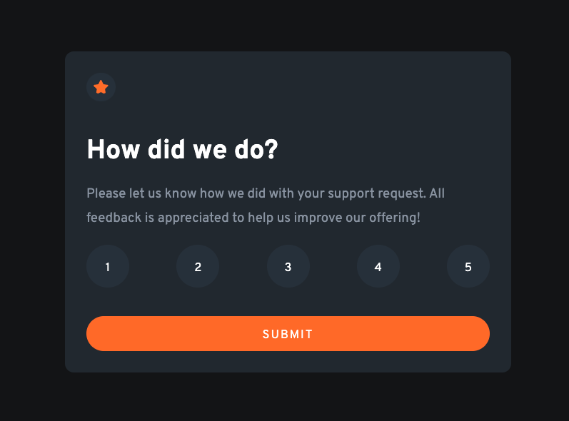

# Interactive Rating Component

## A rating card component challenge from www.frontendmentor.com

This user feedback component was designed according to UX specs on www.frontendmentor.com.

As I complete more front-end challenges, I'm learning that I take great satisfaction from the "aha" moment that comes from building all the little pieces I've interacted with on the internet for years. This simple little component feels like another one to bank, and I'm intruiged to learn how it can be refined in the years to come.

### New Discoveries

In this case, I was actually happiest with going above and beyond. I wanted to explore turning the component into its own mini app, so I added in some code to allow the process to loop. It wasn't complicated, but it is satisfying to tie off loose ends.

### Technologies

* HTML5.
* Vanilla CSS3.
* JavaScript.

### Current goals moving forward:

* Refactor into a React component for ease of reuse.
* Build out a simple back end to mimic a database.